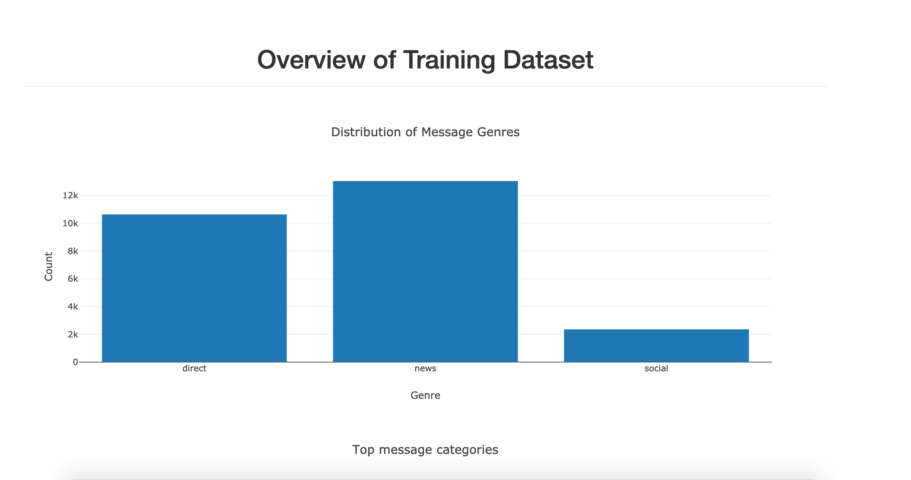

# Disaster Response Pipeline Project

The project aims to classify disaster response messages using machine learning.

### Instructions:
1. Run the following commands in the project's root directory to set up your database and model.

    - To run ETL pipeline that cleans data and stores in database
        `python data/process_data.py data/disaster_messages.csv data/disaster_categories.csv data/DisasterResponse.db`
    - To run ML pipeline that trains classifier and saves
        `python models/train_classifier.py data/DisasterResponse.db models/classifier.pkl`

2. Run the following command in the app's directory to run your web app.
    `python run.py`
https://view6914b2f4-3001.udacity-student-workspaces.com
3. Go to http://0.0.0.0:3001/

view6914b2f4

##  Folder contain subfolders: 

##### Data
1- process_data.py: reads in the data, cleans and stores it in a SQL database. 
2- (dataset) disaster_categories.csv and disaster_messages.csv 
3- DisasterResponse.db: created database from transformed and cleaned data.
##### Models
1- train_classifier.py: includes the code necessary to load data, transform it using natural language processing, run a machine learning model using GridSearchCV and train it. 
##### App
1- run.py: Flask app and the user interface used to predict results and display them.
2- templates: folder containing the html templates

